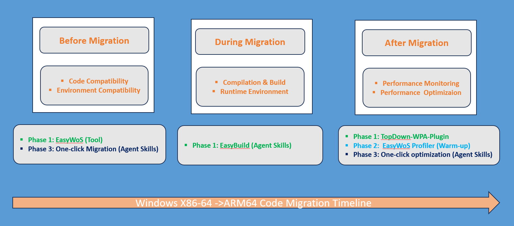

# EasyWoS

**EasyWoS** is a Qualcomm‑backed tool platform purpose‑built to support Windows on Snapdragon (WoS) migration.
It provides end‑to‑end capabilities including software compatibility scanning, environment compatibility analysis, Windows ARM64 build and compilation, and application performance analysis and optimization.
As a unified platform that brings together tools, container images, solutions, best practices, and migration guides, EasyWoS addresses the key challenges and pain points in the WoS migration journey. It helps customers efficiently migrate desktop applications to WoS and delivers a comprehensive, end‑to‑end solution to support the entire migration process.

---

## Features

| Feature | Description | Status |
|---|---|---|
| **Code Compatibility Scanning** | Scans C/C++/Assembly source code for ARM64/ARM64EC compatibility issues, supporting upload and Git repository input | ✅ Available |
| **EasyBuild** | Step-by-step guide for cross-compiling Windows on Arm applications (ARM64/ARM64EC) on x86-64 host machines using MSVC or LLVM toolchains | ✅ Available |
| **Performance Evaluation** | Integration with the Qualcomm Top-Down Tool (WPA plugin) for PMU-based CPU microarchitecture performance analysis | ✅ Available |
| **Performance Optimization** | Advanced optimization recommendations | 🚧 Coming Soon |

---

## Migration Workflow

---

## Architecture

### Backend
- **Framework**: [Sanic](https://sanic.dev/) (async Python web framework)
- **Database**: SQLite via SQLAlchemy 2.0 + aiosqlite
- **Authentication**: JWT (sanic-jwt)
- **Remote Execution**: asyncssh / Fabric for SSH-based machine management
- **Report Generation**: Jinja2 HTML templates

### Frontend
- **Framework**: React 18 + Vite 5
- **UI Library**: Ant Design 5
- **Routing**: React Router 7

### Scanner
- C/C++/ASM compatibility advisor based on ARM64 porting analysis tools
- Supports scanning from uploaded archives (`.zip`, `.rar`, `.tar`, `.tar.gz`, `.tar.xz`) or Git repositories
- Generates HTML and JSON scan reports

---

## Requirements

Only **Docker** is required. All dependencies are bundled in the Docker image.

| Requirement | Minimum | Recommended |
|---|---|---|
| Docker | 17.05 (multi-stage build support) | 20.10+ (LTS, BuildKit enabled by default) |

---

## Quick Start

### 1. Build the Docker Image

```bash
git clone https://github.com/qualcomm/EasyWoS.git
cd EasyWoS
# The tag is easywos:latest and it will be used in the next step
docker build -t easywos:latest .
```

### 2. Run the Container

```bash
# Replace /your/local/workspace with your desired host workspace path
docker run -itd \
  -p 8888:8888 \
  -v /your/local/workspace:/app/workspace \
  --name easywos-container \
  easywos:latest
```

### 3. Access the Application

Open your browser and navigate to:

```
http://localhost:8888
```

### 4. Log In

A default admin account is pre-configured. Use the following credentials to log in:

| Field | Value |
|---|---|
| Username | `admin` |
| Password | `easywos` |

> 💡 These are the default credentials for users outside of Qualcomm.

---

## API Overview

The REST API is available under the `/api` prefix. All endpoints (except authentication) require a JWT Bearer token.

| Prefix | Description |
|---|---|
| `/api/user` | User registration and authentication |
| `/api/machine` | Remote machine (SSH) management |
| `/api/task` | Code compatibility scan task lifecycle |
| `/api/file` | File upload and storage management |
| `/api/evaluation` | Performance evaluation task management |

Interactive API documentation (OpenAPI/Swagger) is available at `/docs` when the server is running.

---

## Development

### Prerequisites

- Python 3.10+
- Node.js 18+
- Docker (for containerized deployment)

### Backend Setup

```bash
pip install -r requirement.txt
python main.py
```

The backend server starts on `http://0.0.0.0:8888`.

### Frontend Setup

```bash
npm install
npm run dev
```

The Vite dev server starts on `http://localhost:5173` with API requests proxied to the backend.

### Production Build

The Docker image performs a multi-stage build:
1. **Stage 1** — Builds the React frontend (`npm run build`)
2. **Stage 2** — Compiles Python dependency wheels
3. **Stage 3** — Assembles the final slim runtime image

---

## Configuration

Key settings are in `settings.py`:

| Setting | Default | Description |
|---|---|---|
| `DEBUG` | `False` | Enable debug mode |
| `DB_URL` | `sqlite+aiosqlite:///workspace/project.db` | Database connection URL |
| `JWT_SECRET_KEY` | *(change in production)* | Secret key for JWT signing |
| `JWT_EXPIRATION_DELTA` | `7200` (2 hours) | JWT token expiration in seconds |
| `REQUEST_MAX_SIZE` | `2000000000` (2 GB) | Maximum upload size |

> ⚠️ **Security Notice**: Change `SECRET` and `JWT_SECRET_KEY` before deploying to production.

---

## Branches

| Branch | Description |
|---|---|
| `main` | Primary development branch. All contributions should be based on and submitted to this branch via pull requests. |

---

## Contributing

Contributions are welcome! Please read the [CONTRIBUTING.md](CONTRIBUTING.md) guide before submitting a pull request.

---

## Getting in Contact

- [Report an Issue on GitHub](../../issues)
- [Open a Discussion on GitHub](../../discussions)
- [Email us](mailto:haozen@qti.qualcomm.com) for general questions

---

## License

EasyWoS is licensed under the [BSD-3-Clause License](https://spdx.org/licenses/BSD-3-Clause.html). See [LICENSE.txt](LICENSE.txt) for the full license text.

Copyright (c) 2026 Qualcomm Technologies, Inc. All Rights Reserved.
